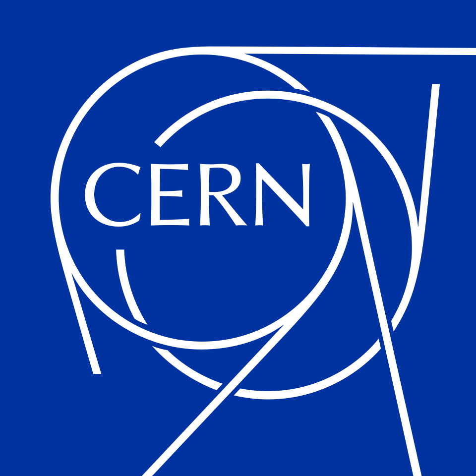
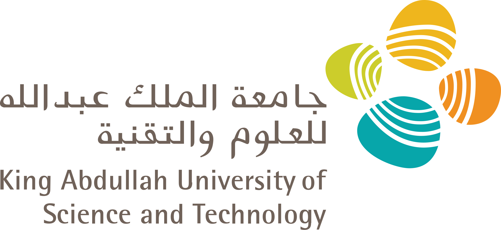
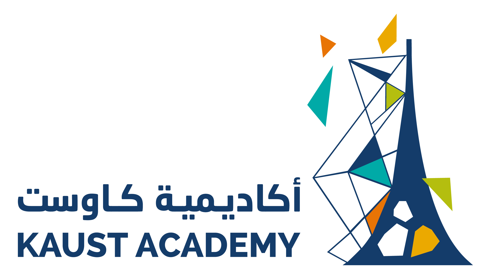
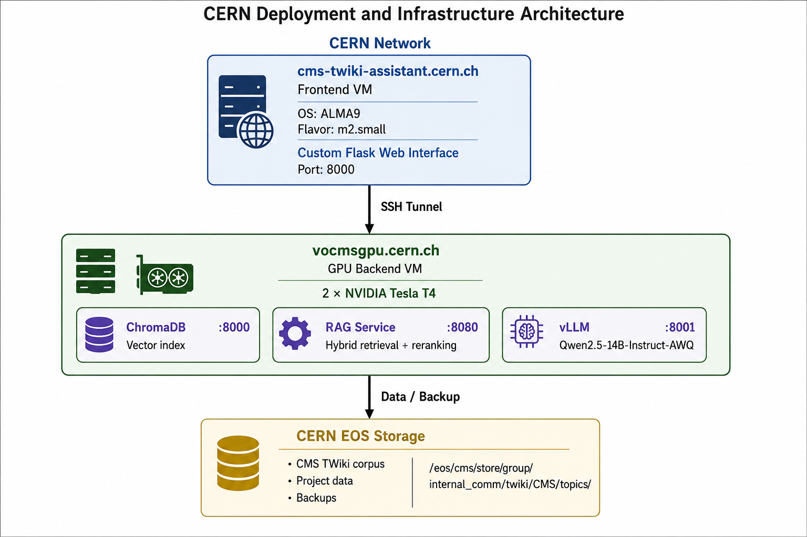

<p align="center">
  <a href="https://home.cern"></a>
  &nbsp;&nbsp;&nbsp;&nbsp;&nbsp;&nbsp;&nbsp;&nbsp;
  <a href="https://cms.cern"></a>
  &nbsp;&nbsp;&nbsp;&nbsp;&nbsp;&nbsp;&nbsp;&nbsp;
  <a href="https://www.kaust.edu.sa"></a>
  &nbsp;&nbsp;&nbsp;&nbsp;&nbsp;&nbsp;&nbsp;&nbsp;
  <a href="https://academy.kaust.edu.sa"></a>
</p>

<h1 align="center">CMS TWiki Assistant</h1>

<p align="center">
  <strong>AI-Powered Semantic Search for CMS Experiment Documentation</strong>
</p>

<p align="center">
  Comparative Study of Documentation Systems for CMS<br>
  with an AI-Assisted Docs-as-Code Prototype
</p>

---

## Team

| Role | Name |
|------|------|
| **Developer** | Buruj Mamdouh Kiahamy |
| **Developer** | Taha Almohamed |
| **Developer** | Abrar Saif Rashid Alsaidi |
| **Supervisor** | Mehnaz Hafeez |

KAUST Academy Internship at CERN — Summer 2026

---

## About

The **CMS TWiki Assistant** is a Retrieval-Augmented Generation (RAG) system that allows members of the CMS Collaboration at CERN to query ~44,700 legacy TWiki documentation pages using natural language. Instead of keyword-based search, users ask questions in plain English and receive LLM-generated answers grounded in retrieved documentation, with source citations.

The project consists of two parts:

**Part 1 — TWiki-to-Markdown Conversion:** A custom 15-phase regex pipeline (`twiki2gfm.py`) that converts TWiki markup to GitHub Flavored Markdown. It was purpose-built for CERN's TWiki corpus after Pandoc's built-in TWiki reader was empirically tested and rejected (55.9% success vs. our 98.6%).

**Part 2 — Semantic Search Pipeline:** A full RAG system — from chunking and embedding through hybrid retrieval (dense + BM25 + reranking) to LLM-powered answer generation — deployed on CERN infrastructure with a web-based chat interface.

> [!IMPORTANT]
> **Private Data:** This project was built on CMS internal TWiki documentation, which is **not publicly available**. The raw TWiki files, converted Markdown, and chunked data are proprietary to the CMS Collaboration at CERN and are not included in this repository.

> [!NOTE]
> **Domain-Specific Code:** The converter, chunker, and retrieval pipeline are specifically designed and tuned for CMS TWiki content. They handle CERN-specific constructs (`%VARIABLES%`, `<noautolink>`, `<nop>`, TWiki metadata, WikiWord auto-linking, CMS-specific signatures) that generic tools like Pandoc cannot process. Adapting this codebase to other TWiki installations would require modifying the conversion rules.

---

## Architecture

<p align="center">
  
</p>

---

## Pipeline Overview

```
TWiki .txt files (44,677)
        │
        ▼
  twiki2gfm.py ──────────── 15-phase regex pipeline, 96 rules
        │                    98.6% success rate, 24 min
        ▼
  GFM .md files (44,060)
        │
        ▼
  chunker_v4.py ─────────── heading-boundary splitting
        │                    400-token target, 50-token overlap
        ▼
  492,674 chunks (JSONL)
        │
        ▼
  embed_to_chroma.py ────── UAE-Large-V1, 1024 dimensions
        │
        ▼
  ChromaDB vector index
        │
        ▼
  rag_service.py ────────── dense + BM25 → RRF → bge-reranker-base
        │
        ▼
  Qwen2.5-14B-Instruct-AWQ  via vLLM
        │
        ▼
  Flask Chat Interface ──── streaming answers with source citations
```

---

## Repository Structure

```
.
├── twiki2gfm.py              # TWiki → GFM converter (15-phase, 96 rules)
├── batch_twiki2gfm.py         # Batch runner for the full corpus + Excel report
├── test_converter.py          # 91 unit tests for the converter
├── chunker_v4.py              # Semantic chunker (filter → clean → chunk)
├── embed_to_chroma.py         # Embedding script (UAE-Large-V1 → ChromaDB)
├── rag_service.py             # RAG backend (hybrid retrieval + LLM orchestration)
├── serve_llm.sh               # vLLM startup script
├── requirements-rag.txt       # Python dependencies for the RAG service
├── cms-rag-ui-v2/             # Flask chat interface
│   ├── app.py                 #   Flask backend (proxy to RAG service)
│   ├── requirements.txt       #   Flask dependencies
│   └── static/
│       ├── index.html         #   Chat UI
│       ├── style.css          #   Styling
│       └── app.js             #   Frontend logic
└── docs/
    └── images/
        └── architecture.png   # Deployment architecture diagram
```

---

## Prerequisites

- **Python 3.11+** (3.12 recommended)
- **NVIDIA GPU** with CUDA support (tested on Tesla T4, 16 GB VRAM)
- **~20 GB disk space** for models and vector database
- TWiki source files (not included — CMS-internal data)

### Python Dependencies

**For the converter and chunker** (no GPU required):

```bash
pip install openpyxl tiktoken
```

**For the RAG service** (GPU required):

```bash
pip install -r requirements-rag.txt
```

This installs: `torch`, `sentence-transformers`, `chromadb`, `fastapi`, `uvicorn`, `httpx`, `rank-bm25`, `numpy`, `pysqlite3-binary`.

**For the chat interface:**

```bash
cd cms-rag-ui-v2
pip install -r requirements.txt
```

This installs: `flask`, `httpx`.

**For the LLM server:**

```bash
pip install vllm
```

---

## Usage

### Part 1: TWiki-to-Markdown Conversion

**Convert a single file:**
```bash
python twiki2gfm.py input.txt -o output.md
```

**Batch-convert a directory of TWiki files:**
```bash
python batch_twiki2gfm.py /path/to/twiki/files/ -o /path/to/output/
```

This produces the converted `.md` files and an Excel report (`twiki2gfm_report.xlsx`) with per-file statistics.

**Run unit tests:**
```bash
python -m pytest test_converter.py -v
```

### Part 2: Chunking

```bash
python chunker_v4.py /path/to/md/files/ -o chunks.jsonl --no-filter
```

Output: a JSONL file where each line is a chunk with metadata (source file, page title, section heading, chunk index, author, date).

### Part 3: Embedding

```bash
python embed_to_chroma.py --input chunks.jsonl --chroma-host localhost --chroma-port 8000
```

This embeds all chunks using UAE-Large-V1 and stores them in ChromaDB. Requires a running ChromaDB server.

### Part 4: Running the Services

Four services must be running simultaneously:

**1. ChromaDB** (vector database):
```bash
chroma run --path /path/to/chroma_db --host 0.0.0.0 --port 8000
```

**2. vLLM** (LLM server):
```bash
bash serve_llm.sh
```

**3. RAG Service** (retrieval + orchestration):
```bash
uvicorn rag_service:app --host 0.0.0.0 --port 8080
```

**4. Chat Interface:**
```bash
cd cms-rag-ui-v2
export RAG_SERVICE_URL=http://localhost:8080
python app.py
```

The chat interface will be available at `http://localhost:8000`.

### API Endpoints

| Endpoint | Method | Description |
|----------|--------|-------------|
| `/health` | GET | Service health check |
| `/search` | POST | Retrieval only (no LLM generation) |
| `/chat` | POST | Full RAG: retrieval + LLM answer (streaming SSE) |

**Example:**
```bash
# Search only
curl -X POST http://localhost:8080/search \
  -H "Content-Type: application/json" \
  -d '{"query": "CMS trigger system", "k": 3}'

# Full RAG chat
curl -X POST http://localhost:8080/chat \
  -H "Content-Type: application/json" \
  -d '{"query": "How does the CMS trigger system work?"}'
```

---

## Technology Stack

| Component | Technology |
|-----------|-----------|
| Converter | Custom Python (15-phase regex, 96 rules) |
| Chunker | Heading-boundary splitting, 400-token target |
| Embedding Model | [UAE-Large-V1](https://huggingface.co/WhereIsAI/UAE-Large-V1) (1024 dim) |
| Vector Database | [ChromaDB](https://www.trychroma.com/) (HTTP server mode) |
| Sparse Retrieval | BM25 (rank-bm25) |
| Fusion | Reciprocal Rank Fusion (RRF) |
| Reranker | [bge-reranker-base](https://huggingface.co/BAAI/bge-reranker-base) |
| LLM | [Qwen2.5-14B-Instruct-AWQ](https://huggingface.co/Qwen/Qwen2.5-14B-Instruct-AWQ) |
| LLM Server | [vLLM](https://github.com/vllm-project/vllm) |
| Chat Interface | Flask + vanilla HTML/CSS/JS |

---

## For CERN Users

<details>
<summary><strong>Click to expand CERN-specific deployment instructions</strong></summary>

### Infrastructure

| Machine | Role | Specs |
|---------|------|-------|
| `cms-twiki-assistant.cern.ch` | Frontend VM | ALMA9, m2.small |
| `vocmsgpu.cern.ch` | GPU Backend | 2× NVIDIA Tesla T4 (16 GB each) |
| `lxplus.cern.ch` | Jump Host | SSH gateway |

### SSH Access

```bash
# Frontend VM
ssh -J bkiahamy@lxplus.cern.ch -i ~/Downloads/mykey.pem root@cms-twiki-assistant.cern.ch

# GPU Backend
ssh -J bkiahamy@lxplus.cern.ch bkiahamy@vocmsgpu.cern.ch
```

### Service Ports on vocmsgpu

| Service | Port | GPU |
|---------|------|-----|
| ChromaDB | 8000 | CPU |
| vLLM | 8001 | GPU 1 |
| RAG Service | 8080 | GPU 0 |

### SSH Tunnel (Frontend → Backend)

Port 8080 on vocmsgpu is not externally accessible. The frontend VM connects via SSH tunnel:

```bash
# Run on cms-twiki-assistant.cern.ch
ssh -N -L 8080:localhost:8080 bkiahamy@vocmsgpu.cern.ch
```

### Starting the Chat Interface

```bash
# On cms-twiki-assistant.cern.ch
cd /root/cms-rag-ui-v2
export RAG_SERVICE_URL=http://localhost:8080
python3 app.py
```

Access: `http://cms-twiki-assistant.cern.ch:8000` (requires CERN network or VPN).

### Storage

All large files and virtual environments on vocmsgpu must be stored under `/var/tmp/` due to AFS home directory quota constraints. This is persistent storage but is lost if the VM is reprovisioned.

### Data Sources

| Path | Content |
|------|---------|
| `/eos/cms/store/group/internal_comm/twiki/CMS/topics/` | Original TWiki corpus |
| `/eos/user/b/bkiahamy/vocmsgpu-backup/` | Project backup on EOS |

### Known Issues

- **pysqlite3-binary:** ChromaDB requires a newer SQLite3 than the system provides. Every script that imports `chromadb` must include the `pysqlite3` swap at the top.
- **vLLM dtype:** Tesla T4 (Turing) does not support bfloat16. The `--dtype half` flag in `serve_llm.sh` is mandatory.
- **Batch size:** ChromaDB rejects payloads > ~5000 vectors. Use batch size 500 during embedding.

</details>

---

## Conversion Results

| Metric | Value |
|--------|-------|
| Total files processed | 44,677 |
| Successfully converted | 44,060 (98.6%) |
| Warnings | 116 (0.26%) |
| Errors | 501 (1.12%) |
| Processing time | 24 minutes |
| Pandoc success rate (comparison) | 55.9% |

---

## License

This project was developed as part of the KAUST Academy Summer Internship Program at CERN (2026) in collaboration with the CMS Collaboration.

---

<p align="center">
  <sub>KAUST Academy × CERN — Summer 2026</sub>
</p>
